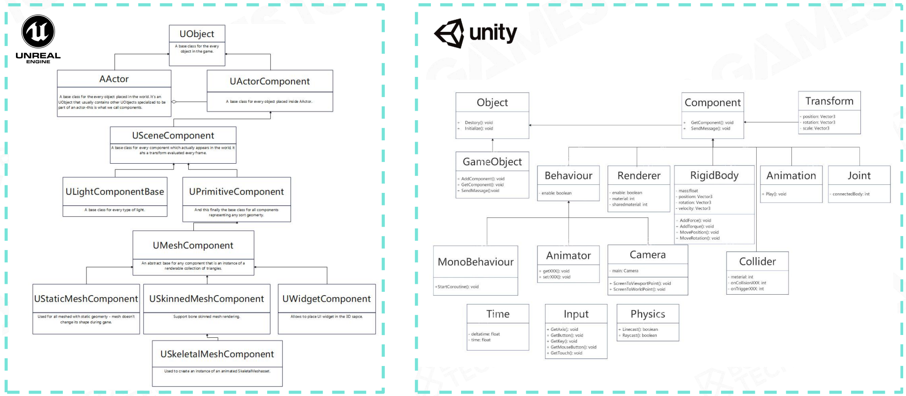
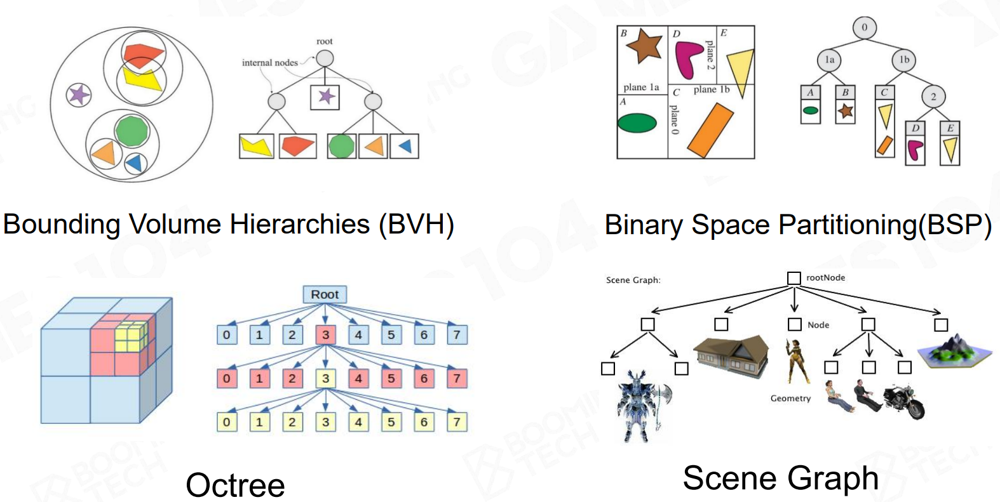

## How to build a game world from the layered architecture
1. 游戏世界由什么东西构成？-- **Game Object(GO)** with properties and behaviors
    - 动态物 Dynamic Game Objects
    - 静态物 Static Game Objects
    - 环境 Environments
    - Other game objects: air wall, trigger Area...

2. **component-based** instead of inheritance-based
   

3. **Component-based Tick**
   
4. **Events** —— 为了实现一个可扩展的消息系统
    - Message sending and handling 消息发送和处理
    - Decoupling event sending and handling 解耦事件发送和处理

5. **Scene Mangement** 场景管理
   

##### 本章小结：
   - Everything is a **game object**
   - Game object could be described in the **component-based** way
   - States of game objects are updated in **tick** loops
   - Game objects interact with each other via **event** mechanism
   - Game objects are **managed in a scene** with efficient strategies

##### 其他挑战 some tricky cases
   - GO Bindings
   - Component Dependencies
   - Immediate Event Sending or not
